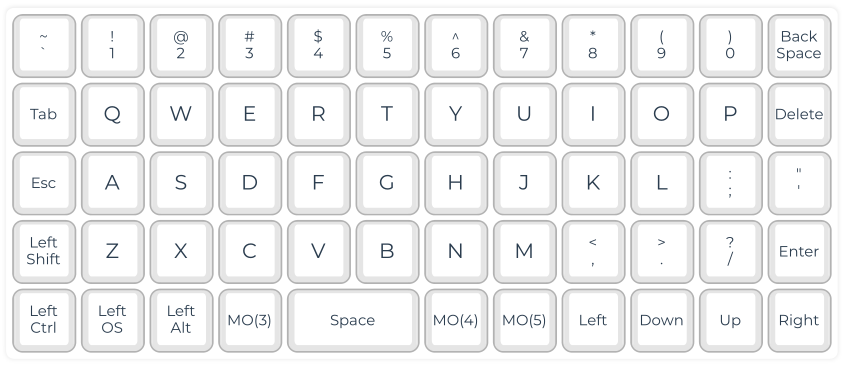
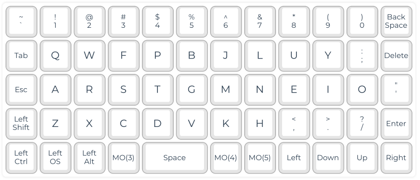
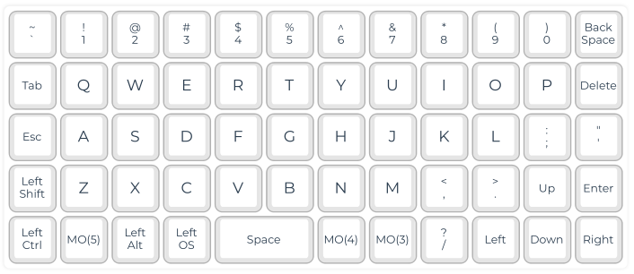
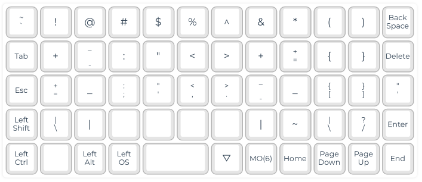
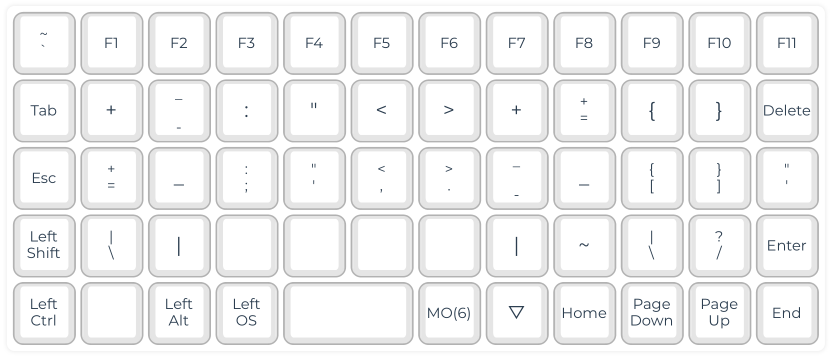
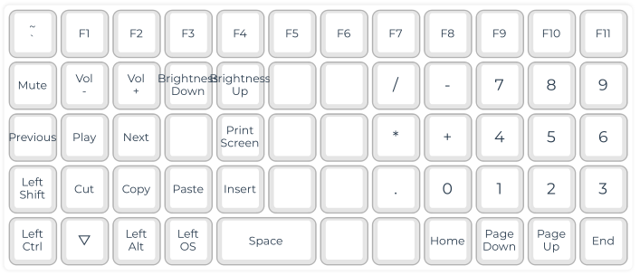
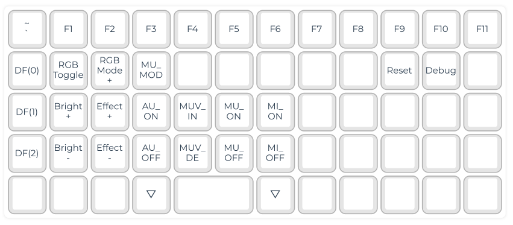

# brokenkeys
Keymap for OLKB Preonic Rev 3

## Layer List
```bash
Layer 0 - QWERTY
Layer 1 - Functions
Layer 2 - DVORAK
Layer 3 - Symbols
Layer 4 - Shortcuts
Layer 5 - Settings
Layer 6 - Coleman MOD-DH
Layer 7 - Arrow Keys
```

# Layers

## Layer 0 - QWERTY


## Layer 1 - Functions


## Layer 2 - DVORAK


## Layer 3 - Symbols


## Layer 4 - Shortcuts


## Layer 5 - Settings


## Layer 6 - Coleman MOD-DH


## Layer 7 - Arrow Keys

